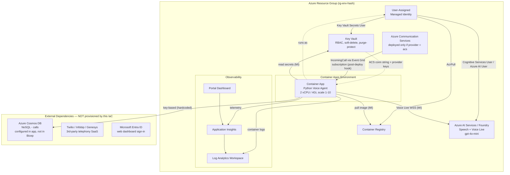
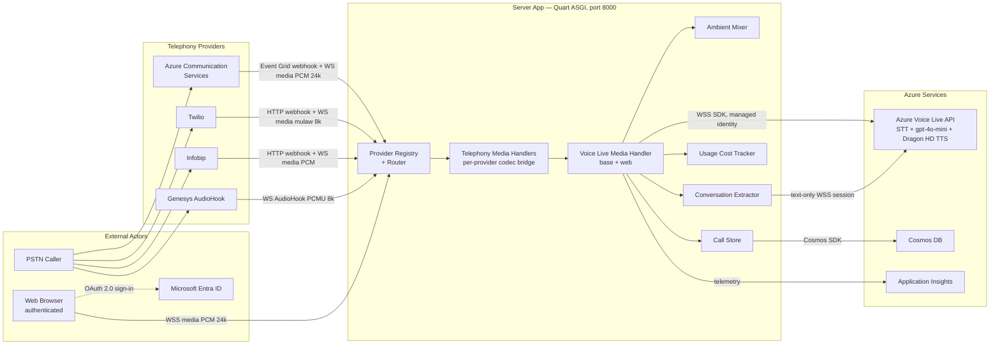
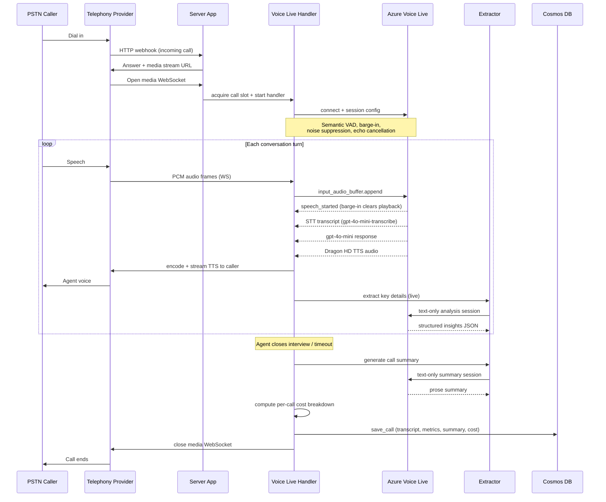

# Architecture — Call Center Voice Agent Accelerator

## Executive Summary

The Call Center Voice Agent Accelerator is an **omnichannel inbound voice solution** that connects callers — over the public telephone network through Azure Communication Services, Twilio, Infobip, or Genesys, plus authenticated web-browser sessions — to a **real-time AI voice agent powered by the Azure Voice Live API**.

A single Python (Quart/ASGI) application running on **Azure Container Apps** routes each call to a low-latency speech pipeline featuring semantic voice-activity detection, natural barge-in, speech-to-text, `gpt-4o-mini` language reasoning, and **Dragon HD** neural text-to-speech. The agent (a mortgage pre-qualification persona, "Maya") conducts a guided, TCPA-compliant conversation, extracts structured key details live, and on completion persists the full transcript, per-turn metrics, an AI summary, and a per-call cost breakdown to **Azure Cosmos DB** for the history and analytics dashboards. Authentication to Azure services is secret-free via a **User-Assigned Managed Identity**, provider credentials are isolated in **Key Vault**, and the workload is fully observable through **Log Analytics + Application Insights**.

---

## 1. Azure Infrastructure (Deployment Topology)

> What `infra/main.bicep` + `azd up` actually provision into a single resource group.

**Deployed by Bicep:** Resource Group · User-Assigned Managed Identity · Container Registry · Container Apps Environment + Container App · Azure AI Services (Speech/Voice Live) · Key Vault · Log Analytics · Application Insights + Dashboard · **ACS *(conditional — only when `telephonyProvider = acs`)***.

**Not in Bicep (external/configured):** Cosmos DB · the ACS Event Grid subscription (created by `hooks/providers/acs.postdeploy.ps1`) · the Twilio/Infobip/Genesys SaaS accounts.

---

## 2. System Architecture (Runtime Components)

---

## 3. Inbound Call Flow

---

## 4. Component Reference

| Component | File | Responsibility |
|---|---|---|
| Quart ASGI App | `server/server.py` | Async web server (port 8000); HTTP routes, WS endpoints, auth middleware, provider dispatch |
| Provider Registry | `server/app/provider_registry.py` | Runtime telephony-provider selection from env (decorator/priority pattern) |
| Config Validator | `server/app/config_validator.py` | Startup validation of Voice Live + provider config (fatal vs warn) |
| Call Manager | `server/app/call_manager.py` | Concurrency caps, max duration, idle timeout, zombie detection |
| Call Loop | `server/app/call_loop.py` | WS loop lifecycle; spawns the Voice Live background task |
| Voice Live Handler (base) | `server/app/handler/voicelive_media_handler.py` | Voice Live SDK connection, session config, event dispatch, metrics, TTS buffering, cost recording |
| Web Media Handler | `server/app/handler/web_media_handler.py` | Browser handler; enables input transcription, live insights, summary, Cosmos persist |
| Ambient Mixer | `server/app/handler/ambient_mixer.py` | DSP mixing of office/call-center background audio with TTS |
| ACS Provider | `server/app/providers/acs/` | `/acs/incomingcall`, `/acs/callbacks`, `/acs/ws`; PCM 24 kHz |
| Twilio Provider | `server/app/providers/twilio/` | `/voice`, `/twilio/ws`; signature validation, TwiML; mulaw 8 kHz to PCM 24 kHz |
| Infobip Provider | `server/app/providers/infobip/` | `/infobip/incoming`, `/infobip/ws`; token auth; PCM, paced output |
| Genesys Provider | `server/app/providers/genesys/` | `/audiohook/ws`; X-API-KEY auth; PCMU 8 kHz to PCM 24 kHz |
| Agent Persona | `server/app/agent_persona.py` | "Maya" persona, system prompt, Ava Dragon HD voice, TCPA/compliance rules |
| Conversation Extractor | `server/app/conversation_extractor.py` | Live key-detail extraction + end-of-call summary via text-only Voice Live sessions |
| Usage Cost Tracker | `server/app/usage_cost.py` | Token to USD mapping; voice / transcribe / extract / summary costs tracked separately |
| Call Store | `server/app/call_store.py` | Cosmos NoSQL persistence; `save_call` upsert, `list_calls`/`get_call`; partition key `/callId` |
| MSAL Auth | `server/app/msal_auth.py` | Microsoft Entra ID OAuth flow for dashboard sign-in |
| Dashboards | `server/static/index.html`, `history.html`, `analytics.html` | Live call UI, call history, analytics |

---

## 5. Key Azure Services & Why

- **Azure Container Apps** — hosts the Python voice agent (2 vCPU / 4 Gi, HTTP autoscale 1→10); environment streams logs to Log Analytics.
- **Azure Container Registry** — stores the app image; pulled via the managed identity's **AcrPull** role.
- **Azure AI Services (Speech + Voice Live)** — the conversation engine: real-time STT (`gpt-4o-mini-transcribe`), `gpt-4o-mini` reasoning, and Dragon HD TTS, all behind the unified Voice Live API.
- **Azure Communication Services** — PSTN telephony; `IncomingCall` events delivered via an Event Grid subscription, media bridged over WebSocket *(deployed only when ACS is the active provider)*.
- **Azure Key Vault** — holds provider credentials (ACS connection string, Twilio/Infobip/Genesys keys) with RBAC, soft-delete and purge protection.
- **User-Assigned Managed Identity** — secret-free auth from the Container App to AI Services, Key Vault and ACR.
- **Log Analytics + Application Insights (+ Dashboard)** — end-to-end logs, metrics, dependencies and exceptions.
- **Azure Cosmos DB (NoSQL)** — persists completed call records for history/analytics. *Configured in the application, not provisioned by this template's IaC.*
- **Microsoft Entra ID** — OAuth 2.0 sign-in for the web dashboards.

---

> ⚠️ **Internal hardening note — remove before sharing externally:** the Cosmos DB endpoint **and a live primary key are hardcoded** in `server/app/call_store.py:16-17`. Before any customer deployment: move them to Key Vault / managed identity, **rotate the exposed key**, and add a Cosmos Bicep module so persistence is provisioned by IaC like every other resource.
